# Architecture Overview

### 🚧 Work in progress

## Design Goals

| Goal                   | Why it matters                                             |
| ---------------------- | ---------------------------------------------------------- |
| Safety & Privacy first | SDK never sees private keys; signers own key custody.      |
| Modular / pluggable    | Chains, tokens, signers and protocols are runtime plugins. |
| Any JS runtime         | Node, Browser, React Native, Workers—all supported.        |
| Unified API            | One façade (`WalletSession`) regardless of chain quirks.   |
| Future‑proof           | New chain types (e.g. EIP‑7702) drop‑in via plugins.       |

---

## System‑level Diagram

> **Insert final SVG / Mermaid here**
> `assets/svg/system-architecture.svg` (recommended) or replace the block below.

```mermaid
flowchart LR
  subgraph "Host App"
    A1[UI / Hooks]
  end
  A1 --> WDK[WDK Core]
  WDK --> Chains{Chain plugins}
  Chains --> Signers{Signer plugins}
  WDK --> Protocols{DeFi Protocol plugins}
  WDK --> Storage[[Persistent Storage]]
  Chains --> RPC[Blockchain Nodes]
  Protocols --> External[3rd‑party Relayers]
```

### Data Flow

1. **Registration** – app registers chains / tokens / signers via `wdk.register*`.
2. **Session** – `wdk.session('arbitrum', 'ledger')` returns a `WalletSession`.
3. **Operation** – UI calls `session.send(tx)` or `bridge.execute()`.
4. **Chain plugin** formats & signs the tx, then submits via RPC.
5. **Storage** records derivation paths and history.

---

## Runtime Components

| Component           | Responsibility                                                |
| ------------------- | ------------------------------------------------------------- |
| **WDK Core**        | Service‑locator, plugin registry, session factory.            |
| **Chain plugin**    | Chain‑specific tx assembly, gas quotes, signing verification. |
| **Signer plugin**   | Owns private keys; provides `sign()` + `getAddress()`.        |
| **Protocol plugin** | Multi‑step workflows (bridge, swap, stake…).                  |
| **Storage**         | Persists derivation paths, tx logs, cached balances.          |

---

## Next Steps

* Deep‑dive into object contracts in **[Core Concepts](./core-concepts.md)**.
* Skip ahead to **§ 5 Integration Patterns** for concrete Web/React or Mobile flows.
