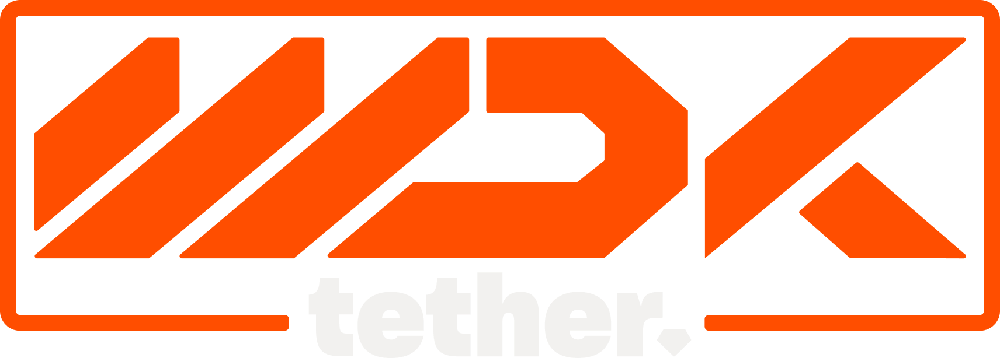

<!-- LOGO PLACEHOLDER -->
<p align="center">
  
</p>

# Wallet Development Kit (WDK)

The Wallet Development Kit (WDK) is Tether's comprehensive open-source solution for building non-custodial blockchain wallets across multiple chains. WDK provides developers with a standardized interface to create wallet applications that hide blockchain complexity from end users while maintaining full user control over their assets.


<p align="center">
  <a href="https://www.npmjs.com/package/wdk-core"></a>
  <a href="https://github.com/your-org/wdk-core/blob/main/LICENSE"></a>
</p>

---

## 👤 Who is this for?
- **Wallet developers** building non-custodial, multi-chain apps
- **Fintech teams** needing secure, flexible blockchain integrations
- **Hackers & tinkerers** exploring blockchain abstraction

---

## ✨ Key Features
- **Multi-Blockchain Support:** Ethereum, Polygon, Arbitrum, TON, Bitcoin, and Spark (Lightning Network)
- **Account Abstraction:** Gasless transactions, flexible fee payments
- **Unified API:** Consistent interface across all supported blockchains
- **Non-Custodial:** Users always control their private keys
- **DeFi Ready:** Native support for token transfers, swaps, and cross-chain bridging
- **Stateless by Design:** No data or secrets are stored—full control remains with you

---

## 🛠️ How it Works
WDK acts as a thin, stateless abstraction layer between your app and multiple blockchains. You provide the configuration and secrets; WDK provides a unified API for all wallet operations.

```
[Your App] → [WDK] → [Ethereum | Bitcoin | TON | Spark]
```

- No data is ever stored by WDK.
- All sensitive operations are performed in-memory.
- You decide how to manage keys, sessions, and storage.

---

## 📚 Documentation Overview

- [Getting Started](getting-started.md)
- [React Native Usage](react-native.md)
- [Core Concepts](core-concepts.md)
- [API Reference](api-reference.md)
- [Supported Blockchains](supported-blockchains.md)
- [Security](security.md)
- [FAQ](faq.md)
- [Resources](resources.md)

---

## 🤝 Contributing
We welcome contributions! Please see our [contributing guidelines](CONTRIBUTING.md) and open issues or pull requests.

## 💬 Support
- For questions, open an [issue](https://github.com/your-org/wdk-core/issues)
- For security concerns, email: security@yourdomain.com

---

© Wallet Development Kit Team