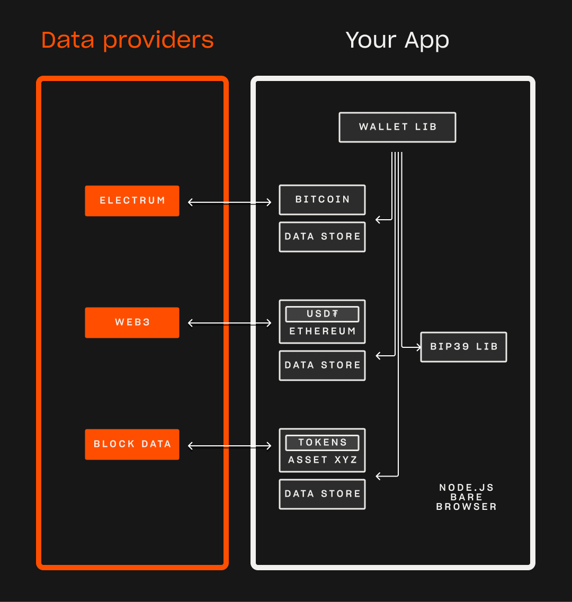

<p align="center" width="100">
<a href="https://github.com/tetherto/lib-wallet">

</a>
</p>

# Wallet Dev Kit by Tether

Multi asset cryptocurrency wallet library in JavaScript.
Supported on 3 platforms:  Node.js, Browser, Bare Runtime


## ⭐ Features

🔑 **Non custodial:** not your keys, not your coins.

🧩 **Composable:** Single facade to interact with multiple assets and wallets

📦 **Modular:** All components are modular and can be used independently.

🛠️ **Extensible:** Easily add new asset, seed source, block source...etc

## 🔗 Blockchains

### [Bitcoin](./blockchains/wallet-pay-btc.md)
- Electrum block data source. Support for TCP and Websocket on browser. 
- P2WPKH / BIP84 address support.

### [USDt on Ethereum](./blockchains/wallet-pay-eth-erc20.md)
- Web3 and [Wallet indexer](./components/wallet-indexer.md) block data source.
- ERC20 support.
- BIP44 address generation.

### More assets coming soon

| Blockchain   	|  Supported  | Token Protocol
|---	        |---	      |--
|  Bitcoin 	    |  ✅ 	      | -
|  Ethereum  	|  ✅ 	      | ERC20
|  Tron 	    |  ⌛ 	      | TRC20
|  TON 	        |   ⌛	      | Jettons
|  Avalanche 	|   ⌛	      | C-Chain
|  Solana 	    |  ⌛ 	      | Solana Token
|  Celo 	    |   ⌛	      | ERC20
|  Liquid 	    |  ⌛ 	      | Liquid Asset
|  Tezos 	    |  ⌛ 	      | Tezos Token
|  Aptos 	    |  ⌛ 	      | Fungible Asset
|  Cosmos 	    |  ⌛ 	      | ERC20
|  Near 	    |  ⌛ 	      | Near Token
|  Polkadot 	|  ⌛ 	      | AssetHub

**additional support coming soon**


### 🏗️ Architecture


### 🧩 Components
The library comes with all the components needed to build a wallet. You can also use these as an example to build your own components.

- [Wallet seed](./components/wallet-seed.md): Generate BIP39 seed for all assets 
- [Wallet store](./components/wallet-store.md): Store transaction history and track state.
- [Wallet indexer](./components/wallet-indexer.md): Remote blockchain data provider
- [Wallet test-tools](./components/wallet-test-tools.md): Tools for development and testing 

### **</>**  Example Usage

Checkout [Quick start guide](./guides/getting-started.md) for a more detailed guide.

```javascript

  const seed = await BIP39Seed.generate(/** seed phrase or leave empty to generate one */)

  // Setup wallet store. Modular data store for  writing data
  const store = new WalletStoreHyperbee({
    store_path: './wallet-store' // Leave empty to use in-memory store
  })

  // Setup Bitcoin asset
  const btcPay = new BitcoinPay({
    // Asset name is used to identify the asset in the wallet.
    // You can have multiple assets of same currency
    asset_name: 'btc',
    // Bitcoin network you'll be using
    network: 'regtest'
  })

  // Setup main wallet class
  const wallet = new Wallet({
    store,
    seed,
    // List of assets 
    assets: [ btcPay ]
  })

  // Start wallet and initialize
  // Connect to block source 
  // Add asset to wallet registry 
  await wallet.initialize()

  // Traverse wallet history of all assets and sync them. This might take a while depending on wallet size 
  await wallet.syncHistory(opts)


  // All payment features are namespaced under wallet.pay[asset_name][action](opts, ...args)
  // Get a new bitcoin address using api below
  const btcAddress = await wallet.pay.btc.getNewAddress()

  // Get Tx history

  await wallet.pay.btc.getTransactions((tx) =>{
    // do something here 
  }))
  //done 

```

# Development

## 🚀 Getting started

The best way to get started developing:

1. Setup local development environment.
2. Configure example apps to connect to your local blockchains.
3. Start hacking on example apps.
After you have example apps running:
- Fork/modify existing assets
- Build new assets.

## 🐚 Seashell Example Wallet
There is a working example wallet that supports. This wallet can be used as an example for making your own integrations.
- [Node.js cli wallet](./examples/node/seashell-node.md)
- [Bare runtime cli wallet](./examples/bare/seashell-bare.md)
- [AI Demo Web wallet](./examples/web/ai-demo-app.md)

## 🛠️ Dev Environment
The wallet is designed to work with local test environments. 
- See [Wallet test tools](./components/wallet-test-tools.md) to setup local environments 
- Setup [Wallet indexer](./components/wallet-indexer.md) service

## 🍱 Building your own asset
See [guide](./guides/integrating-new-assets.md) for how to add new assets

## 🧪 Testing
- [Brittle](https://github.com/holepunchto/brittle) is used for testing
- Tests included in this repo cover
    - Shared modules
    - Integration of various blockchains
- Each asset has it's own tests included in it's repo.
