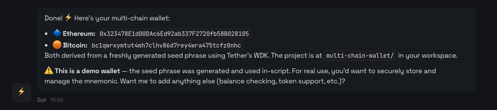

# OpenClaw (Community Skill)


The WDK skill for OpenClaw is a community skill, developed and maintained independently by a third-party contributor.

Tether and the WDK Team do not endorse or assume responsibility for its code, security, or maintenance. Use your own judgment and proceed at your own risk.


[OpenClaw](https://openclaw.ai) is an open-source AI agent platform. With the WDK community skill, your OpenClaw agent can create wallets, send transactions, swap tokens, bridge assets, and interact with DeFi protocols. Everything stays self-custodial.


The WDK skill follows the [AgentSkills specification](https://agentskills.io/specification), so it works with any compatible agent platform. This page covers the OpenClaw-specific setup.


## Install the WDK Community Skill

Install from [ClawHub](https://clawhub.ai/HumanRupert/tether-wallet-development-kit):

```bash
npx clawhub install tether-wallet-development-kit
```

This installs the skill into your workspace's `skills/` directory. OpenClaw picks it up automatically on the next session.


You might see a VirusTotal warning during installation. It flags the skill as suspicious because it handles crypto keys and calls external APIs. This is normal for any wallet SDK skill. Review the skill's source code on [ClawHub](https://clawhub.ai/HumanRupert/tether-wallet-development-kit) before proceeding.



We plan to publish the WDK skill to its own GitHub repository. Once that's live, you'll also be able to install via `git clone`. For now, use ClawHub.


## Configuration

The WDK skill does not require environment variables. Your agent will ask for a seed phrase in conversation when it needs to create or recover a wallet. The skill passes the seed phrase as a constructor parameter in code rather than reading it from configuration.


Your seed phrase controls real funds. Never share it, commit it to version control, or expose it in logs. The skill instructs agents to never log or expose seed phrases or private keys.


## Verify It Works

Start a new OpenClaw session and try a simple prompt:

```
Create a multi-chain wallet with Ethereum and Bitcoin support, then show me the addresses.
```

The agent should use the WDK skill to create wallet accounts and return the generated addresses. All write operations (transactions, swaps, bridges) require your explicit confirmation before executing.

<figure><figcaption><p>Example output from the WDK skill creating a multi-chain wallet</p></figcaption></figure>

## What Your Agent Can Do

Once the skill is loaded, your agent can:

- **Create wallets** across 20+ blockchains (EVM, Bitcoin, Solana, TON, Tron, Spark)
- **Send transactions** and token transfers
- **Swap tokens** via DEX aggregators (Velora, StonFi)
- **Bridge assets** cross-chain with USDT0
- **Lend and borrow** through Aave V3
- **Buy and sell crypto** via MoonPay fiat on/off-ramps

For the full list of capabilities and how skills work, see [Agent Skills](agent-skills.md).

## Security Risks and Safety Precautions

OpenClaw is powerful because it runs on your system and can take real actions like creating files, fetching data from the web, and executing transactions. That same power can become a security risk if you're not careful about how and where you run it.

This isn't a flaw in OpenClaw. It's what happens when you give any AI agent direct system access. Knowing these risks lets you use OpenClaw safely.

### Why running OpenClaw locally requires caution

When you run OpenClaw on your own computer or a virtual server, you're allowing a chat interface to trigger actions on that system. This is a concern if your bot:

- Has access to sensitive directories
- Runs with elevated privileges
- Is connected to a publicly accessible chat
- Receives poorly scoped instructions

It can unintentionally modify files, overwrite data, or expose information you didn't intend to share. The risk isn't that OpenClaw is malicious. The risk is that it will do exactly what it's told, even when the instruction is vague or unsafe.

### How to use OpenClaw safely

To reduce risk, here are some practical safety measures:

- Run OpenClaw as a non-privileged user
- Keep its working files in a dedicated directory
- Avoid connecting it to public or shared chats initially
- Be explicit when asking it to read or write files
- Test new capabilities on a disposable system or VM

Think of OpenClaw the same way you'd think about running scripts on your system: powerful and useful, but something you need to be careful with.

## Next Steps

- [Agent Skills](agent-skills.md) - Full capabilities, how skills work, and a comparison with other agentic wallet solutions
- [MCP Toolkit](mcp-toolkit/README.md) - Programmatic wallet access for MCP-compatible agents
- [OpenClaw Skills Documentation](https://docs.openclaw.ai/tools/skills) - How OpenClaw discovers and loads skills

***

## Need Help?


