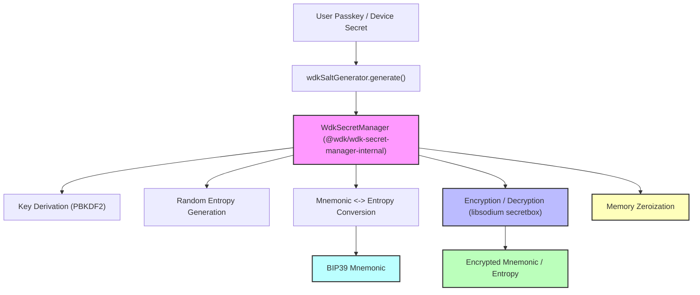

# Secret Manager

## Introduction

The Secret Manager is a secure, in-memory system for generating, encrypting, decrypting, and managing wallet seed phrases (mnemonics) and sessions. It is designed for use in wallet applications where user secrets must be protected and never persistently stored in plaintext. This module provides a robust foundation for building secure, user-friendly wallet experiences across multiple blockchain ecosystems.

**Key Features:**
- Secure mnemonic (seed phrase) generation and encryption
- In-memory session management (no persistent plaintext secrets)
- Support for multiple wallet types (EVM, Bitcoin, TON, etc.)
- Extensible architecture for new blockchains
- Easy integration with React/React Native and Node.js environments

---

## Seed Phrases in Blockchain

A **seed phrase** (also known as a mnemonic phrase or recovery phrase) is a sequence of words generated by a wallet that gives access to the cryptocurrency associated with that wallet. Seed phrases are typically based on the BIP39 standard and are used to deterministically generate all the private keys and addresses for a blockchain wallet.

**Key points:**
- A seed phrase is usually 12 or 24 words, human-readable, and must be kept secret.
- Anyone with access to the seed phrase can control all assets in the wallet.
- Seed phrases are the ultimate backup: losing it means losing access to funds; leaking it means losing security.
- Modern wallets use the seed phrase to derive all cryptographic keys, making it the single point of recovery and risk.

**Why secure management matters:**
- Storing or transmitting seed phrases insecurely exposes users to theft and loss.
- Best practices require never storing the seed phrase in plaintext, and always encrypting it with a strong user secret.
- Secure, in-memory handling and prompt purging of sensitive data are essential for wallet security.

---

## About `@wdk/wdk-secret-manager-internal`

The Secret Manager relies on [`@wdk/wdk-secret-manager-internal`](https://github.com/noxtton/wdk-secret-manager-internal.git) for all cryptographic operations. This package is a robust JavaScript library for securely managing BIP39 mnemonic phrases and related secrets. It provides:

- **Key Derivation:** Uses a user-provided passkey and a unique salt to derive a strong cryptographic key (PBKDF2, 256-bit, 100,000 iterations, SHA-256).
- **Mnemonic Encryption/Decryption:** Encrypts and decrypts BIP39 mnemonic phrases and entropy using libsodium’s secretbox (XSalsa20-Poly1305).
- **Random Generation:** Generates cryptographically secure random entropy and salts.
- **Mnemonic Utilities:** Converts between entropy and BIP39 mnemonic phrases.
- **Memory Safety:** Securely wipes sensitive buffers from memory after use.

## API Reference

### `@wdk/wdk-secret-manager-internal`

#### `WdkSecretManager`
- **Constructor:**  
  `new WdkSecretManager(passKey, salt)`
  - `passKey`: User’s password or device secret (string or Buffer)
  - `salt`: Unique, random 16-byte Buffer (not secret, but must be unique per user/session)

- **Methods:**
  - `generateAndEncrypt(payload?, derivedKey?)`  
    Generates random entropy (or uses provided), converts to mnemonic, and returns encrypted seed and entropy.
  - `decrypt(payload, derivedKey?)`  
    Decrypts an encrypted payload (seed or entropy) and returns the original buffer.
  - `generateRandomBuffer()`  
    Generates a random 128-bit buffer (for 12-word mnemonics).
  - `entropyToMnemonic(entropy)`  
    Converts entropy buffer to a BIP39 mnemonic string.
  - `mnemonicToEntropy(mnemonic)`  
    Converts a BIP39 mnemonic string to entropy buffer.
  - `destructor(decryptedSeedBuffer, decryptedEntropy)`  
    Securely wipes all sensitive data from memory.

#### `wdkSaltGenerator`
- **`generate()`**  
  Returns a cryptographically secure, random 16-byte salt Buffer.

### Security Notes
- **Passkey Strength:** The security of encrypted data depends on the strength of the passkey. Always use strong, unique passkeys.
- **Salt Management:** Salts must be unique per user/session and stored alongside the encrypted data. Never reuse salts.
- **No Plaintext Storage:** No sensitive data is ever persisted in plaintext; all cryptographic operations are performed in memory.
- **Memory Zeroization:** Sensitive buffers are wiped from memory after use using `sodium-universal`.

### Example Usage

```js
import WdkSecretManager, { wdkSaltGenerator } from '@wdk/wdk-secret-manager-internal';

const salt = wdkSaltGenerator.generate();
const passkey = 'user-strong-password';
const wdkManager = new WdkSecretManager(passkey, salt);

// Generate and encrypt a new mnemonic
const { encryptedSeed, encryptedEntropy } = wdkManager.generateAndEncrypt();

// Decrypt the mnemonic
const decryptedEntropy = wdkManager.decrypt(encryptedEntropy);
const mnemonic = wdkManager.entropyToMnemonic(decryptedEntropy);

// Clean up sensitive data
wdkManager.destructor(null, decryptedEntropy);
```

---

## Usage Guide: `@wdk/wdk-secret-manager-internal` Implementation

### 1. Install the Library

> **Note:** This package is currently private. You must have access to the GitHub repository (`https://github.com/noxtton/wdk-secret-manager-internal.git`). Ensure your SSH keys are configured and your GitHub account has the necessary permissions.

#### Step 1: Add the dependency to your `package.json`

```jsonc
{
  // ...
  "dependencies": {
    // ...
    "@wdk/wdk-secret-manager-internal": "git+ssh://git@github.com:noxtton/wdk-secret-manager-internal.git"
    // ...
  }
  // ...
}
```

#### Step 2: Install the package

```sh
npm install
```

If you encounter permission errors:
- Make sure your SSH key is added to your GitHub account ([GitHub SSH setup guide](https://docs.github.com/en/authentication/connecting-to-github-with-ssh)).
- Confirm you have been granted access to the repository.
- If you are using a CI/CD environment, ensure the build agent has the correct SSH credentials.

---

### 2. Import the Library

```js
import WdkSecretManager, { wdkSaltGenerator } from '@wdk/wdk-secret-manager-internal';
```

---

### 3. Generate a Salt and Create a Secret Manager Instance

```js
// Generate a cryptographically secure random salt (16 bytes)
const salt = wdkSaltGenerator.generate();

// Define a strong user passkey (string or Buffer)
const passkey = 'my-very-strong-password';

// Create the secret manager instance
const secretManager = new WdkSecretManager(passkey, salt);
```

---

### 4. Generate and Encrypt a New Mnemonic

```js
// Generate random entropy and encrypt it
const { encryptedSeed, encryptedEntropy } = secretManager.generateAndEncrypt();

// (Optional) Convert the entropy to a BIP39 mnemonic phrase
const decryptedEntropy = secretManager.decrypt(encryptedEntropy);
const mnemonic = secretManager.entropyToMnemonic(decryptedEntropy);

// Always securely wipe sensitive buffers after use
secretManager.destructor(null, decryptedEntropy);
```

---

### 5. Encrypt an Existing Mnemonic

```js
// Convert a mnemonic phrase to entropy
const mnemonic = 'abandon abandon abandon ...'; // 12-word BIP39 mnemonic
const entropy = secretManager.mnemonicToEntropy(mnemonic);

// Encrypt the entropy
const { encryptedEntropy } = secretManager.generateAndEncrypt(entropy);

// Wipe the entropy buffer
secretManager.destructor(null, entropy);
```

---

### 6. Decrypt an Encrypted Mnemonic

```js
// Decrypt the encrypted entropy buffer
const decryptedEntropy = secretManager.decrypt(encryptedEntropy);

// Convert entropy back to mnemonic
const mnemonic = secretManager.entropyToMnemonic(decryptedEntropy);

// Wipe the decrypted buffer
secretManager.destructor(null, decryptedEntropy);
```

---

### 7. Security Best Practices

- Always use a strong, unique passkey for each user.
- Store the salt alongside the encrypted data (the salt is not secret, but must be unique).
- Never store the passkey or mnemonic in plaintext.
- Always wipe sensitive buffers from memory after use with `destructor`.

## Security Considerations

- All cryptographic operations are handled by `@wdk/wdk-secret-manager-internal`.
- Always purge sensitive buffers after use.
- Never persist the plaintext mnemonic or passkey.
- Only expose session info for debugging; never in production.
- Use strong, user-specific passkeys and random salts.
- Integrate with secure device storage (e.g., Secure Enclave, Keychain, Android Keystore) for passkey management if possible.
- Review and update dependencies regularly to address security vulnerabilities.


---

## Architecture Overview



- **Core Modules:**
  - All cryptographic operations (key derivation, encryption, decryption, random generation) are handled by `@wdk/wdk-secret-manager-internal`.
  - Session and wallet management logic orchestrates the use of this package for secure workflows.

- **Security Principles:**
  - All sensitive operations are delegated to `@wdk/wdk-secret-manager-internal`.
  - Buffers containing secrets are securely wiped after use.
  - No sensitive data is persisted unless explicitly encrypted.

---

## Core Concepts

- **Mnemonic:** A BIP39-compatible seed phrase used to derive wallet keys.
- **Passkey:** User-provided secret (password or device secret) used to encrypt/decrypt mnemonics.
- **Salt:** Random value used in key derivation to strengthen encryption.
- **Session:** In-memory object holding the current mnemonic, encrypted mnemonic, salt, and passkey (for the session’s lifetime only).

---

## Extending the Secret Manager

- To support new wallet types, add cases to your wallet management logic and implement the required wallet manager logic.
- Ensure all new code follows the same security and memory management practices as enforced by `@wdk/wdk-secret-manager-internal`.
- Contribute improvements and bug fixes via pull requests.

---

## Troubleshooting & FAQ

**Q: Why am I getting '(not implemented)' for some wallet types in `deriveAddresses`?**
A: Only EVM and EVM-ERC4337 are implemented by default. Add support for other types in your wallet management logic as needed.

**Q: How do I securely store the passkey?**
A: Use platform-specific secure storage (e.g., iOS Keychain, Android Keystore) and never hardcode secrets.

**Q: What happens if the app crashes?**
A: All in-memory secrets are lost. Users must re-authenticate and restore sessions using their passkey and encrypted mnemonic.

**Q: Can I use this in a browser?**
A: Yes, but ensure you use secure context (HTTPS) and consider additional protections for browser memory.

**Q: How do I add support for a new blockchain?**
A: Implement the wallet logic and add a case in your wallet management code.

---

## References
- [@wdk/wdk-secret-manager-internal](https://github.com/noxtton/wdk-secret-manager-internal.git)
- [BIP39: Mnemonic code for generating deterministic keys](https://github.com/bitcoin/bips/blob/master/bip-0039.mediawiki)
- [sodium-universal](https://github.com/sodium-friends/sodium-universal)
