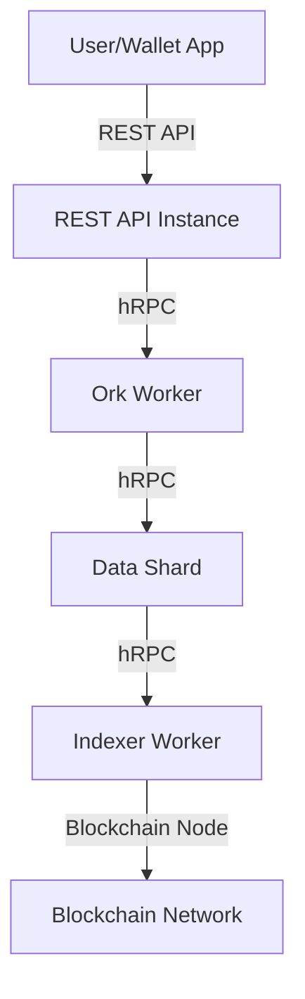

# Transaction History: Architecture & Integration

## Overview

Retrieving transaction history for cryptocurrency users is a complex challenge, especially when supporting multiple blockchains. While simple blockchains like Bitcoin may allow for device-side indexing, this approach quickly becomes impractical for more complex or high-throughput networks such as Ethereum, TON, or Solana. The WDK Indexer provides a scalable, open-source infrastructure to efficiently index and deliver comprehensive transaction history to your users.

## Table of Contents
1. [Introduction](#introduction)
2. [Challenges of Transaction History Across Blockchains](#challenges-of-transaction-history-across-blockchains)
3. [WDK Indexer: Architecture Overview](#wdk-indexer-architecture-overview)
    - [Core Components](#core-components)
    - [Data Flow](#data-flow)
4. [Integration Strategy & Best Practices](#integration-strategy--best-practices)
    - [Fallback Hierarchy](#fallback-hierarchy)
    - [Access & Availability](#access--availability)
5. [Example Integration Flow](#example-integration-flow)
6. [References](#references)

---

## Introduction

Transaction history is a critical feature for wallet users, providing transparency, accountability, and a complete record of all asset movements. Supporting this feature across multiple blockchains introduces significant technical challenges due to differences in network architecture, throughput, and data accessibility.

## Challenges of Transaction History Across Blockchains

- **Simple Blockchains (e.g., Bitcoin):** Device-side indexing is feasible for low-throughput chains, but can still be resource-intensive.
- **Complex/High-Throughput Chains (e.g., Ethereum, TON, Solana):** The volume and complexity of transactions make device-side indexing impractical or impossible. Efficient, scalable infrastructure is required to deliver timely and accurate transaction history.

## WDK Indexer: Architecture Overview

The WDK Indexer is designed to provide a robust, scalable solution for transaction history retrieval. It leverages Hyper technology by Holepunch and is composed of several core components:

### Core Components

1. **REST API Instances**
   - **Role:** Frontend gateway and request proxy
   - **Functionality:**
     - Authentication using bearer tokens
     - User identification and caching via local HyperBee
     - Request routing to Ork workers using CRC32 hashing
     - Communication via hRPC protocol
     - **Repository:** `wdk-app-node`

2. **Ork Workers**
   - **Role:** Request routing and data aggregation
   - **Functionality:**
     - Process proxied requests from REST API
     - Communicate with Data Shards to aggregate user data
     - Route requests based on user ID or wallet address
     - **Repository:** `wdk-ork-wrk`

3. **Data Shards**
   - **Role:** User data management and storage
   - **Functionality:**
     - Proc Worker (Writer): Queries Indexer workers for daily balance updates, retrieves transactions, stores user data, performs cleanup
     - API Worker (Reader): Provides query interface for user data, proxies write operations, handles real-time balance requests
     - **Repository:** `wdk-data-shard-wrk`

4. **Indexer Workers**
   - **Role:** Blockchain-specific block sync and balance queries
   - **Functionality:**
     - Proc Worker: Stores blockchain blocks, implements cleanup
     - API Worker: Exposes hRPC server for queries, provides real-time address balance lookups
     - **Repositories:**
       - `wdk-indexer-wrk-base` (common)
       - `wdk-indexer-wrk-eth` (Ethereum)
       - `wdk-indexer-wrk-btc` (Bitcoin)
       - Additional blockchain-specific implementations

### Data Flow



## Integration Strategy & Best Practices

### Fallback Hierarchy

To ensure reliability and performance, implement a fallback strategy for transaction history and balance retrieval:

1. **Primary:** WDK Indexer for optimal performance and comprehensive data
2. **Secondary:** Direct WDK methods for essential balance queries
3. **Tertiary:** Local cache for offline or degraded scenarios

### Access & Availability

The WDK Indexer codebase is currently in active development and not yet publicly released. Anticipatory access is available for developers who wish to integrate early or evaluate the system before the official release. Contact the WDK team for more information.

## Example Integration Flow

```js
// Pseudocode for retrieving transaction history with fallback
async function getTransactionHistory(userId, walletAddress) {
  try {
    // 1. Try WDK Indexer (recommended)
    return await fetchFromWdkIndexer(userId, walletAddress);
  } catch (indexerError) {
    try {
      // 2. Fallback: Direct WDK method
      return await fetchFromWdkModule(walletAddress);
    } catch (wdkError) {
      // 3. Fallback: Local cache
      return getFromLocalCache(walletAddress);
    }
  }
}
```
> **Note:** Replace with actual API calls and error handling as per your stack and application logic.

## References
- WDK Indexer repositories (contact for access)
- [Holepunch Hyper technology](https://hypercore-protocol.org/)
- [WDK Documentation](../README.md)