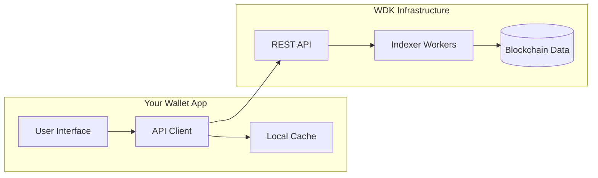

# Transaction History: Developer Integration Guide

## Overview

Transaction history is the backbone of any cryptocurrency wallet, providing users with a complete record of their asset movements across multiple blockchains. This guide explains how to integrate robust transaction history into your wallet application using the WDK infrastructure.

**Target Audience**: Wallet developers integrating transaction history functionality
**Prerequisites**: Basic understanding of blockchain concepts and REST APIs
**Related Documentation**: [WDK Indexer Overview](indexer.md) | [API Reference](indexer/indexer-api-reference.md)

## Table of Contents

1. [What Is Transaction History?](#what-is-transaction-history)
2. [Blockchain Models & Data Implications](#blockchain-models--data-implications)
3. [WDK API Integration](#wdk-api-integration)
4. [Client Implementation Patterns](#client-implementation-patterns)
5. [UI/UX Considerations](#uiux-considerations)
6. [Security & Privacy](#security--privacy)
7. [Performance Optimization](#performance-optimization)
8. [Next Steps](#next-steps)

---

## What Is Transaction History?

**Transaction history is a chronological record of all asset movements for a user's addresses, providing transparency and auditability of their cryptocurrency holdings.**

### User Expectations

Users expect their wallet to show:
- **Complete transaction list**: All incoming and outgoing transfers
- **Real-time updates**: New transactions appear immediately
- **Rich metadata**: Token names, logos, fiat values, transaction status
- **Smart grouping**: Related transfers grouped logically
- **Search and filtering**: Find specific transactions quickly

### Technical Requirements

```typescript
interface TransactionHistoryRequirements {
  // Data completeness
  multiChain: boolean;           // Support multiple blockchains
  realTime: boolean;             // Live updates for new transactions
  historical: boolean;           // Complete historical data
  
  // Performance
  pagination: boolean;           // Handle large datasets efficiently
  caching: boolean;              // Minimize API calls
  offline: boolean;              // Basic functionality without network
  
  // User experience
  filtering: boolean;            // By token, amount, date, direction
  searching: boolean;            // Find specific transactions
  grouping: boolean;             // Related transactions together
}
```

## Blockchain Models & Data Implications

**Different blockchain architectures require different approaches to transaction history retrieval.**

### UTXO Model (Bitcoin, Litecoin)

```javascript
// Bitcoin transaction: Multiple inputs/outputs
{
  "txid": "abc123...",
  "inputs": [
    {"address": "1ABC...", "amount": "0.5"},
    {"address": "1DEF...", "amount": "0.3"}  // User's address
  ],
  "outputs": [
    {"address": "1GHI...", "amount": "0.7"},   // Recipient
    {"address": "1DEF...", "amount": "0.09"}  // Change back to user
  ]
}
```

**Key Challenge**: One transaction may represent multiple logical transfers. Change outputs must be identified and handled appropriately.

### Account-Based Model (Ethereum, EVM Chains)

```javascript
// Ethereum transaction with token transfer
{
  "hash": "0xdef456...",
  "from": "0xUserAddress...",
  "to": "0xTokenContract...",     // Contract address, not recipient
  "value": "0",                   // No ETH transferred
  "logs": [
    {
      "topics": ["0xddf252ad1be2c89b69c2b068fc378daa952ba7f163c4a11628f55a4df523b3ef"],
      "data": "0x...",             // Encoded transfer details
      "address": "0xTokenContract..."
    }
  ]
}
```

**Key Challenge**: Token transfers are embedded in event logs, not transaction values. Contract interactions may have multiple effects.

### Message-Based Model (Solana, TON)

```javascript
// Solana transaction with multiple instructions
{
  "signature": "abc123...",
  "instructions": [
    {
      "programId": "TokenkegQfeZyiNwAJbNbGKPFXCWuBvf9Ss623VQ5DA",
      "accounts": ["sender", "recipient", "mint"],
      "data": "encoded_instruction_data"
    }
  ]
}
```

**Key Challenge**: Multiple instructions per transaction create complex interaction patterns requiring careful parsing.

## WDK API Integration

**The WDK provides a unified API for transaction history across all supported blockchains.**

### Architecture Overview



**For detailed architecture information, see**: [WDK Indexer Overview](indexer.md)

### Authentication & Setup

```javascript
// Initialize WDK client
const wdkClient = new WDKClient({
  baseURL: 'https://api.your-wdk-instance.com',
  apiKey: process.env.WDK_API_KEY,
  timeout: 30000
});

// Authenticate user session
const session = await wdkClient.authenticate({
  userId: 'user_123',
  addresses: [
    '1BTC_ADDRESS...',
    '0xETH_ADDRESS...',
    'SOL_ADDRESS...'
  ]
});
```

### Basic Transaction Retrieval

```javascript
// Get transaction history
async function getTransactionHistory(options = {}) {
  try {
    const response = await wdkClient.get('/v1/transactions', {
      params: {
        limit: options.limit || 50,
        cursor: options.cursor,
        tokens: options.tokens?.join(','),
        direction: options.direction,
        fromDate: options.fromDate,
        toDate: options.toDate
      }
    });
    
    return {
      transactions: response.data.transactions,
      pagination: response.data.pagination,
      meta: response.data.meta
    };
    
  } catch (error) {
    throw new TransactionHistoryError('Failed to fetch transactions', error);
  }
}
```

### Standardized Response Schema

```typescript
interface Transaction {
  // Core identification
  blockchain: string;           // "bitcoin", "ethereum", "solana", etc.
  transactionHash: string;      // Transaction ID/hash
  blockNumber: bigint;          // Block height
  transactionIndex?: number;    // Position within block
  logIndex?: number;           // For token transfers (EVM)
  
  // Transfer details
  direction: 'in' | 'out' | 'self';
  from?: string;               // Sender address
  to?: string;                 // Recipient address
  token: string;               // "btc", "eth", "usdt", etc.
  amount: string;              // Decimal amount as string
  
  // Metadata
  timestamp: string;           // ISO 8601 timestamp
  status: 'pending' | 'confirmed' | 'failed';
  confirmations: number;       // Network confirmations
  fee?: string;               // Transaction fee in native token
  
  // Optional enhanced data
  fiatValue?: string;         // USD value at time of transaction
  description?: string;       // User or system-generated description
  metadata?: Record<string, any>; // Chain-specific data
}

interface PaginationInfo {
  hasNext: boolean;
  cursor?: string;             // Opaque cursor for next page
  limit: number;
  total?: number;              // Total count if available
}
```

### Error Handling

```javascript
class TransactionHistoryError extends Error {
  constructor(message, originalError, code) {
    super(message);
    this.name = 'TransactionHistoryError';
    this.code = code;
    this.originalError = originalError;
  }
}

// Robust error handling with fallback
async function getTransactionsWithFallback(options) {
  try {
    // Primary: WDK Indexer
    return await getTransactionHistory(options);
    
  } catch (error) {
    if (error.code === 'RATE_LIMITED') {
      // Implement exponential backoff
      await delay(Math.pow(2, retryCount) * 1000);
      return getTransactionsWithFallback(options);
    }
    
    if (error.code === 'SERVICE_UNAVAILABLE') {
      // Fallback to cached data
      const cached = await getCachedTransactions(options);
      return {
        ...cached,
        source: 'cache',
        stale: true
      };
    }
    
    throw error;
  }
}
```

## Client Implementation Patterns

### React Hook for Transaction History

```jsx
import { useState, useEffect, useCallback } from 'react';

function useTransactionHistory(addresses, options = {}) {
  const [state, setState] = useState({
    transactions: [],
    loading: true,
    error: null,
    hasMore: true,
    cursor: null
  });

  const loadTransactions = useCallback(async (reset = false) => {
    try {
      setState(prev => ({ ...prev, loading: true, error: null }));
      
      const response = await getTransactionHistory({
        addresses,
        cursor: reset ? null : state.cursor,
        limit: options.limit || 50,
        ...options.filters
      });

      setState(prev => ({
        transactions: reset 
          ? response.transactions 
          : [...prev.transactions, ...response.transactions],
        loading: false,
        hasMore: response.pagination.hasNext,
        cursor: response.pagination.cursor,
        error: null
      }));

    } catch (error) {
      setState(prev => ({ 
        ...prev, 
        loading: false, 
        error 
      }));
    }
  }, [addresses, options, state.cursor]);

  // Load initial data
  useEffect(() => {
    if (addresses?.length > 0) {
      loadTransactions(true);
    }
  }, [addresses]);

  return {
    ...state,
    loadMore: () => loadTransactions(false),
    refresh: () => loadTransactions(true)
  };
}
```

### Pagination Implementation

```javascript
class TransactionPaginator {
  constructor(apiClient) {
    this.apiClient = apiClient;
    this.pageSize = 50;
  }

  async *getAllTransactions(addresses, filters = {}) {
    let cursor = null;
    let hasMore = true;
    
    while (hasMore) {
      const response = await this.apiClient.getTransactions({
        addresses,
        cursor,
        limit: this.pageSize,
        ...filters
      });
      
      yield response.transactions;
      
      cursor = response.pagination.cursor;
      hasMore = response.pagination.hasNext;
    }
  }

  // Usage example
  async loadAllUserTransactions(addresses) {
    const allTransactions = [];
    
    for await (const transactionBatch of this.getAllTransactions(addresses)) {
      allTransactions.push(...transactionBatch);
      
      // Progress callback
      this.onProgress?.(allTransactions.length);
      
      // Rate limiting
      await new Promise(resolve => setTimeout(resolve, 100));
    }
    
    return allTransactions;
  }
}
```

### Real-Time Updates

```javascript
class RealTimeTransactionUpdates {
  constructor(apiClient, addresses) {
    this.apiClient = apiClient;
    this.addresses = new Set(addresses);
    this.subscribers = new Set();
    this.ws = null;
  }

  subscribe(callback) {
    this.subscribers.add(callback);
    
    // Initialize WebSocket connection if first subscriber
    if (this.subscribers.size === 1) {
      this.connect();
    }
    
    // Return unsubscribe function
    return () => {
      this.subscribers.delete(callback);
      if (this.subscribers.size === 0) {
        this.disconnect();
      }
    };
  }

  connect() {
    this.ws = new WebSocket(`wss://api.your-wdk-instance.com/transactions/live`);
    
    this.ws.onopen = () => {
      // Subscribe to address updates
      this.ws.send(JSON.stringify({
        type: 'subscribe',
        addresses: Array.from(this.addresses)
      }));
    };

    this.ws.onmessage = (event) => {
      const data = JSON.parse(event.data);
      
      if (data.type === 'transaction') {
        // Notify all subscribers
        this.subscribers.forEach(callback => {
          try {
            callback(data.transaction);
          } catch (error) {
            console.error('Subscriber callback failed:', error);
          }
        });
      }
    };

    this.ws.onclose = () => {
      // Implement reconnection logic
      setTimeout(() => this.connect(), 5000);
    };
  }

  disconnect() {
    if (this.ws) {
      this.ws.close();
      this.ws = null;
    }
  }
}
```

### Caching Strategy

```javascript
class TransactionCache {
  constructor(storage = localStorage) {
    this.storage = storage;
    this.ttl = 5 * 60 * 1000; // 5 minutes
  }

  getCacheKey(addresses, filters) {
    const key = {
      addresses: addresses.sort(),
      filters: this.normalizeFilters(filters)
    };
    return `tx_history_${this.hashObject(key)}`;
  }

  async get(addresses, filters) {
    const key = this.getCacheKey(addresses, filters);
    const cached = this.storage.getItem(key);
    
    if (!cached) return null;
    
    const data = JSON.parse(cached);
    const age = Date.now() - data.timestamp;
    
    if (age > this.ttl) {
      this.storage.removeItem(key);
      return null;
    }
    
    return data.transactions;
  }

  async set(addresses, filters, transactions) {
    const key = this.getCacheKey(addresses, filters);
    const data = {
      transactions,
      timestamp: Date.now()
    };
    
    try {
      this.storage.setItem(key, JSON.stringify(data));
    } catch (error) {
      // Handle storage quota exceeded
      this.cleanup();
      this.storage.setItem(key, JSON.stringify(data));
    }
  }

  cleanup() {
    // Remove expired entries
    const keys = Object.keys(this.storage);
    const now = Date.now();
    
    keys.forEach(key => {
      if (key.startsWith('tx_history_')) {
        try {
          const data = JSON.parse(this.storage.getItem(key));
          if (now - data.timestamp > this.ttl) {
            this.storage.removeItem(key);
          }
        } catch (error) {
          this.storage.removeItem(key);
        }
      }
    });
  }
}
```

## UI/UX Considerations

### Transaction Status Display

```jsx
function TransactionStatus({ transaction }) {
  const getStatusConfig = (tx) => {
    if (tx.status === 'pending') {
      return {
        color: 'orange',
        icon: 'clock',
        text: `Pending (${tx.confirmations}/${getRequiredConfirmations(tx.blockchain)})`
      };
    }
    if (tx.status === 'confirmed') {
      return {
        color: 'green', 
        icon: 'check',
        text: `Confirmed (${tx.confirmations})`
      };
    }
    return {
      color: 'red',
      icon: 'x',
      text: 'Failed'
    };
  };

  const config = getStatusConfig(transaction);
  
  return (
    <div className={`status status-${config.color}`}>
      <Icon name={config.icon} />
      <span>{config.text}</span>
    </div>
  );
}
```

### Grouping Related Transactions

```jsx
function TransactionGroup({ transactions }) {
  // Group by transaction hash (multiple token transfers in one tx)
  const grouped = transactions.reduce((groups, tx) => {
    groups[tx.transactionHash] = groups[tx.transactionHash] || [];
    groups[tx.transactionHash].push(tx);
    return groups;
  }, {});

  return (
    <div className="transaction-groups">
      {Object.entries(grouped).map(([hash, txs]) => (
        <div key={hash} className="transaction-group">
          <div className="group-header">
            <span className="timestamp">
              {formatTimestamp(txs[0].timestamp)}
            </span>
            <span className="hash">{hash.slice(0, 8)}...</span>
          </div>
          
          {txs.map((tx, i) => (
            <TransactionItem key={i} transaction={tx} />
          ))}
        </div>
      ))}
    </div>
  );
}
```

### Filtering and Search

```jsx
function TransactionFilters({ onFiltersChange }) {
  const [filters, setFilters] = useState({
    tokens: [],
    direction: 'all',
    dateRange: null,
    amountRange: null
  });

  const handleFilterChange = (newFilters) => {
    setFilters(newFilters);
    onFiltersChange(newFilters);
  };

  return (
    <div className="transaction-filters">
      <TokenSelector 
        selected={filters.tokens}
        onChange={(tokens) => handleFilterChange({ ...filters, tokens })}
      />
      
      <DirectionFilter
        value={filters.direction}
        onChange={(direction) => handleFilterChange({ ...filters, direction })}
      />
      
      <DateRangePicker
        value={filters.dateRange}
        onChange={(dateRange) => handleFilterChange({ ...filters, dateRange })}
      />
    </div>
  );
}
```

**For complete UI/UX patterns and components, see**: [Transaction History UI Patterns](transaction-history-ui-patterns.md)

## Security & Privacy

### Address Privacy

```javascript
// Don't expose unused addresses
function filterUserRelevantTransactions(transactions, knownAddresses) {
  return transactions.filter(tx => {
    return knownAddresses.includes(tx.from) || 
           knownAddresses.includes(tx.to);
  });
}

// Hash addresses for analytics
function getAnalyticsId(address) {
  return crypto.subtle.digest('SHA-256', 
    new TextEncoder().encode(address + ANALYTICS_SALT)
  ).then(buffer => 
    Array.from(new Uint8Array(buffer.slice(0, 8)))
      .map(b => b.toString(16).padStart(2, '0'))
      .join('')
  );
}
```

### Rate Limiting Protection

```javascript
class ClientRateLimiter {
  constructor(maxRequests = 100, windowMs = 60000) {
    this.requests = [];
    this.maxRequests = maxRequests;
    this.windowMs = windowMs;
  }

  async checkLimit() {
    const now = Date.now();
    
    // Remove old requests
    this.requests = this.requests.filter(time => now - time < this.windowMs);
    
    if (this.requests.length >= this.maxRequests) {
      const oldestRequest = Math.min(...this.requests);
      const waitTime = this.windowMs - (now - oldestRequest);
      throw new Error(`Rate limited. Try again in ${Math.ceil(waitTime / 1000)}s`);
    }
    
    this.requests.push(now);
  }
}
```

### Input Validation

```javascript
function validateTransactionRequest(params) {
  const errors = [];
  
  // Validate addresses
  if (params.addresses) {
    params.addresses.forEach(address => {
      if (!isValidAddress(address)) {
        errors.push(`Invalid address format: ${address}`);
      }
    });
  }
  
  // Validate pagination
  if (params.limit && (params.limit < 1 || params.limit > 200)) {
    errors.push('Limit must be between 1 and 200');
  }
  
  // Validate date range
  if (params.fromDate && params.toDate) {
    if (new Date(params.fromDate) > new Date(params.toDate)) {
      errors.push('fromDate must be before toDate');
    }
  }
  
  if (errors.length > 0) {
    throw new ValidationError(errors.join(', '));
  }
}
```

## Performance Optimization

### Efficient Data Loading

```javascript
// Load transactions with intelligent batching
class OptimizedTransactionLoader {
  constructor(apiClient) {
    this.apiClient = apiClient;
    this.batchSize = 50;
    this.prefetchSize = 10;
  }

  async loadWithPrefetch(addresses, options = {}) {
    // Load initial batch
    const firstBatch = await this.loadBatch(addresses, {
      ...options,
      limit: this.batchSize
    });
    
    // Prefetch next batch in background
    if (firstBatch.pagination.hasNext) {
      this.prefetchNext(addresses, {
        ...options,
        cursor: firstBatch.pagination.cursor,
        limit: this.prefetchSize
      });
    }
    
    return firstBatch;
  }

  async prefetchNext(addresses, options) {
    try {
      const nextBatch = await this.loadBatch(addresses, options);
      // Cache prefetched data
      this.cacheResults(options, nextBatch);
    } catch (error) {
      console.warn('Prefetch failed:', error);
    }
  }
}
```

### Memory Management

```javascript
// Efficient transaction list with virtual scrolling
class VirtualTransactionList {
  constructor(container, itemHeight = 80) {
    this.container = container;
    this.itemHeight = itemHeight;
    this.visibleCount = Math.ceil(container.clientHeight / itemHeight) + 2;
    this.transactions = [];
    this.renderOffset = 0;
  }

  setTransactions(transactions) {
    this.transactions = transactions;
    this.updateVisibleItems();
  }

  updateVisibleItems() {
    const scrollTop = this.container.scrollTop;
    const startIndex = Math.floor(scrollTop / this.itemHeight);
    const endIndex = Math.min(
      startIndex + this.visibleCount,
      this.transactions.length
    );

    // Only render visible items
    const visibleTransactions = this.transactions.slice(startIndex, endIndex);
    this.renderItems(visibleTransactions, startIndex);
  }

  renderItems(items, offset) {
    // Render only visible transaction items
    // Implementation depends on your UI framework
  }
}
```

### Caching Best Practices

```javascript
// Multi-level caching strategy
class TransactionCacheManager {
  constructor() {
    this.memoryCache = new Map();           // Fast in-memory cache
    this.localStorageCache = new LocalStorageCache(); // Persistent cache
    this.sessionCache = new Map();          // Session-only cache
  }

  async get(key, addresses, filters) {
    // 1. Check memory cache first (fastest)
    if (this.memoryCache.has(key)) {
      return this.memoryCache.get(key);
    }

    // 2. Check session cache
    if (this.sessionCache.has(key)) {
      const data = this.sessionCache.get(key);
      this.memoryCache.set(key, data); // Promote to memory
      return data;
    }

    // 3. Check persistent cache
    const cached = await this.localStorageCache.get(addresses, filters);
    if (cached) {
      this.sessionCache.set(key, cached);
      this.memoryCache.set(key, cached);
      return cached;
    }

    return null;
  }

  async set(key, addresses, filters, data) {
    // Store in all cache levels
    this.memoryCache.set(key, data);
    this.sessionCache.set(key, data);
    await this.localStorageCache.set(addresses, filters, data);
  }
}
```

## Next Steps

### Complete Implementation

1. **Review UI Patterns**: [Transaction History UI Patterns](transaction-history-ui-patterns.md)
2. **Explore Examples**: [Complete Code Examples](transaction-history-examples.md)  
3. **Production Setup**: [Indexer Deployment Guide](indexer/indexer-deployment.md)

### Advanced Features

1. **Testing Strategy**: [Indexer Testing Guide](indexer/indexer-testing.md)
2. **Monitoring Setup**: [Indexer Monitoring](indexer/indexer-monitoring.md)
3. **Performance Tuning**: [Indexer Performance](indexer/indexer-performance.md)

### Architecture Deep Dive

1. **Indexer Overview**: [WDK Indexer Architecture](indexer.md)
2. **API Reference**: [Complete API Documentation](indexer/indexer-api-reference.md)
3. **Configuration**: [Indexer Configuration Guide](indexer/indexer-configuration.md)

### Getting Help

- **Documentation Issues**: Create issue in WDK documentation repository
- **Integration Support**: Contact WDK team for integration assistance
- **Bug Reports**: Use the appropriate WDK repository for technical issues

---

> **Note**: This guide focuses on client-side integration. For infrastructure setup, deployment, and operational concerns, refer to the [WDK Indexer documentation](indexer.md) and related operational guides.