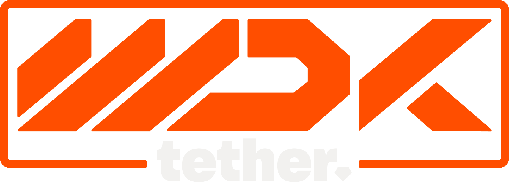

<p align="center">
  
</p>


## What is WDK?

WDK is a **developer-first framework** to create cross-chain wallets that are secure, extensible, and production-ready. It provides a single, stateless API to interact with EVM, TON, TRON, Solana, Bitcoin and Spark (Lightning Network)—abstracting blockchain-specific complexity while keeping developers in full control of keys and data.

---

## Key Features

- **Multi-Blockchain Support**: Ethereum, Polygon, Arbitrum, Bitcoin, TON, Spark, Solana
- **Unified API Layer**: A single interface across chains
- **Account Abstraction**: Enable gasless transactions & custom fee logic on EVM, TON & Tron
- **Stateless & Secure**: No secrets or data are stored by WDK
- **Non-Custodial by Design**: You manage keys; WDK never sees them
- **DeFi Ready**: Built-in support for swaps, token transfers, and cross-chain actions
- **Modular & Extensible**: Add your own chains, tokens, or business logic

---

## Who is WDK for?

### Developers & Builders
- Create mobile/web wallets in minutes using a familiar JS/TS interface
- Integrate advanced features like account abstraction without reinventing the wheel

### Startups & Enterprises
- Launch wallet products with full ownership of UX, logic, and keys
- Customize flows like tipping, swapping, buying/selling, and more

### Educators & Innovators
- Use WDK to prototype, test, and teach wallet development across major blockchains

---

## How It Works

WDK is **stateless**: it processes requests but stores nothing. All sensitive data (keys, sessions, configs) stays in your hands.

```
[Your App] → [WDK API] → [Ethereum | Bitcoin | TON | Spark | Tron | Solana]
```

This guarantees:
- No custodial risk
- Full user control
- Flexibility to scale or pivot

---

## Use Cases

- Build wallets for creators, communities, or DAOs
- Integrate wallet functions into DeFi, payments, gaming, or tipping apps
- Develop cross-platform wallet experiences (React Native, Electron, Web)

---

## Supported Blockchains

WDK supports a growing set of blockchains. This list is continuously expanding, with **more integrations coming soon**. Chains marked with ⏳ are in active development.

| Chain/Module                                                      | Type             | Supported |
|-------------------------------------------------------------------|------------------|-----------|
| [EVM](../wdk-modules/wallet-modules/wallet-evm/overview.md)   | EVM  /  L2       | ✅        |
| [EVM ERC-4337](../wdk-modules/wallet-modules/wallet-evm-erc-4337/overview.md)       | EVM Gasless      | ✅        |
| [Bitcoin](../wdk-modules/wallet-modules/wallet-btc/overview.md)                     | Native           | ✅        |
| [TON](../wdk-modules/wallet-modules/wallet-ton/overview.md)                         | Non-EVM          | ✅        |
| [TON Gasless](../wdk-modules/wallet-modules/wallet-ton-gasless/overview.md)         | TON Gasless      | ✅        |
| [Spark](../wdk-modules/wallet-modules/wallet-spark/overview.md)                     | *                | ✅        |
| [Solana](../wdk-modules/wallet-modules/wallet-solana/overview.md)                   | Non-EVM          | ✅        |
| [TRON](../wdk-modules/wallet-modules/wallet-tron/overview.md)                       | Non-EVM          | ✅        |
| [TRON Gasfree](../wdk-modules/wallet-modules/wallet-tron-gasfree/overview.md)       | TRON Gasfree     | ✅        |
| [Ark](https://github.com/tetherto/wdk-wallet-ark)    | *    | ⏳        |

---

## Completely non custodial

WDK never stores or transmits secrets. Developers are responsible for key storage using secure techniques like OS keychain, HSMs, or hardware wallets. All operations are performed in-memory.

---

## Open Source Vision

We are committed to making WDK fully open-source in 2025. Join us now to shape its roadmap and be part of a growing ecosystem of developers creating the next generation of crypto wallets.

---
