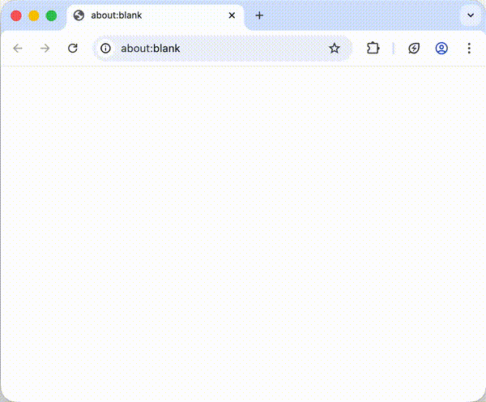

# Showcase


Showcase projects are developed and maintained independently by third-party contributors.

Tether and the WDK Team do not endorse or assume responsibility for their code, security, or maintenance. Use your own judgment and proceed at your own risk.



Looking for community-built WDK modules you can install and use in your project? Check out the [Community Modules](../sdk/community-modules/README.md) page instead.


## Featured Projects

---

### wdk-starter-browser-extension

> Self-custodial browser extension wallet starter built on WDK.

**Author:** Base58 ([Website](https://base58.io/), [GitHub](https://github.com/base58-io)) / alexszolowicz ([GitHub](https://github.com/alexszolowicz-blockether))
**Repository:** [github.com/base58-io/wdk-starter-browser-extension](https://github.com/base58-io/wdk-starter-browser-extension)

A browser extension starter kit that demonstrates how to build a self-custodial wallet using WDK. Provides a ready-made template for creating Chrome-compatible extension wallets with secure key management and transaction signing.

<figure></figure>

---

### wdk-wallet-evm-x402-facilitator

> x402 payment facilitator adapter for WDK EVM wallets.

**Author:** SemanticPay ([Website](https://www.semanticpay.io/), [GitHub](https://github.com/SemanticPay))
**Repository:** [github.com/SemanticPay/wdk-wallet-evm-x402-facilitator](https://github.com/SemanticPay/wdk-wallet-evm-x402-facilitator)

An adapter that enables WDK EVM wallets to act as x402 payment facilitators. Bridges the WDK wallet interface with the x402 HTTP payment protocol, allowing servers to charge for API access using on-chain payments.

---

### x402-usdt0

> End-to-end x402 reference implementation on Plasma with USDT0 and WDK.

**Author:** baghdadgherras ([GitHub](https://github.com/baghdadgherras))
**Repository:** [github.com/baghdadgherras/x402-usdt0](https://github.com/baghdadgherras/x402-usdt0)

A complete reference implementation demonstrating the x402 HTTP payment protocol using USDT0 on the Plasma network. Includes both client and server components, showcasing how WDK wallets can facilitate machine-to-machine payments in a real-world setup.

---

### wdk-mcp

> AI-powered blockchain operations via Model Context Protocol.

**Author:** Seven ([GitHub](https://github.com/dieselftw))
**Repository:** [github.com/dieselftw/wdk-mcp](https://github.com/dieselftw/wdk-mcp)

Integrates WDK capabilities within the MCP (Model Context Protocol) ecosystem, allowing AI Agents to perform blockchain operations such as signing, transactions, and wallet interactions securely and locally. This project expands the reach of WDK to autonomous systems and AI-driven workflows.

## Submit Your Project

If you've built something using WDK, we'd love to showcase it.

Projects listed here should:
- Use one or more WDK modules or SDKs
- Be open source or publicly accessible
- Include a clear README and installation instructions

Your work may be featured in future updates, social posts, or documentation spotlights.

Submit your project through our [Community Form](https://forms.gle/wmNwc5epxaa85u8a9) below or share it on our [**#wdk-showcase** Discord channel](https://discordapp.com/channels/1425125849346216029/1427975123406688267).

<a class="button primary" href="https://forms.gle/wmNwc5epxaa85u8a9">Submit your project</a>
