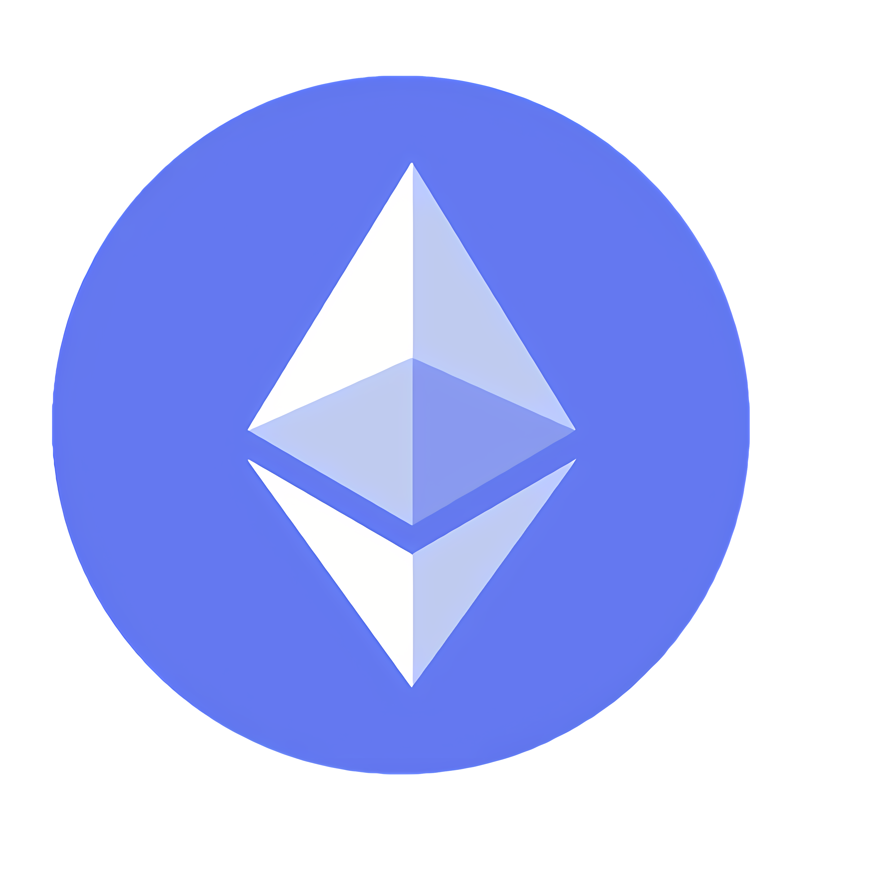

The Wallet Development Kit (WDK) provides a set of modules that support multiple blockchain networks. All modules share a common interface, ensuring consistent behavior across different blockchain implementations.

## Supported Networks

This package works with multiple blockchain networks through wallet registration.

<table data-card-size="small" data-view="cards">
  <thead>
    <tr>
      <th></th>
      <th>Type</th>
      <th>Purpose</th>
      <th data-hidden data-card-target data-type="content-ref"></th>
    </tr>
  </thead>
  <tbody>
    <tr>
      <td></td>
      <td><strong>Bitcoin</strong></td>
      <td>Bitcoin Mainnet</td>
      <td>
        <a href="../wallet-modules/wallet-btc/">wallet-btc</a>      
      </td>
    </tr>
    <tr>
      <td></td>
      <td><strong>EVM Chains</strong></td>
      <td>Ethereum, Sepolia Testnet, L2s, etc.</td>
      <td>
        <a href="../wallet-modules/wallet-evm/">wallet-evm</a>, 
        <a href="../wallet-modules/wallet-evm-erc-4337/">wallet-evm-erc-4337</a>
      </td>
    </tr>
    <tr>
      <td></td>
      <td><strong>TRON</strong></td>
      <td>Tron Mainnet</td>
      <td>
        <a href="../wallet-modules/wallet-tron/">wallet-tron</a>, 
        <a href="../wallet-modules/wallet-tron-gasfree/">wallet-tron-gasfree</a>
      </td>
    </tr>
    <tr>
      <td></td>
      <td><strong>TON</strong></td>
      <td>TON Mainnet</td>
      <td>
        <a href="../wallet-modules/wallet-ton/">wallet-ton</a>, 
        <a href="../wallet-modules/wallet-ton-gasless/">wallet-ton-gasless</a>
      </td>
    </tr>
    <tr>
      <td></td>
      <td><strong>Solana</strong></td>
      <td>Solana Mainnet</td>
      <td>
        <a href="../wallet-modules/wallet-solana/">wallet-solana</a>      </td>
    </tr>
     <tr>
      <td>
        <picture>
          <source 
            srcset="/assets/logos/spark-logo-dark.png" 
            media="(prefers-color-scheme: dark)" 
            type="image/png" />
          <source 
            srcset="/assets/logos/spark-logo-light.png" 
            media="(prefers-color-scheme: light)" 
            type="image/png" />
          
        </picture>
      </td>
      <td><strong>Spark</strong></td>
      <td>Spark Mainnet</td>
      <td>
        <a href="../wallet-modules/wallet-spark/">wallet-spark</a>      
      </td>
    </tr>
  </tbody>
</table>

## Classic Wallet Modules

Standard wallet implementations that use native blockchain tokens for transaction fees:

| Module | Blockchain | Status | Documentation |
|--------|------------|--------|---------------|
| [`@tetherto/wdk-wallet-evm`](https://github.com/tetherto/wdk-wallet-evm) | EVM | ✅ Ready | [Documentation](./wallet-evm) |
| [`@tetherto/wdk-wallet-ton`](https://github.com/tetherto/wdk-wallet-ton) | TON | ✅ Ready | [Documentation](./wallet-ton) |
| [`@tetherto/wdk-wallet-btc`](https://github.com/tetherto/wdk-wallet-btc) | Bitcoin | ✅ Ready | [Documentation](./wallet-btc) |
| [`@tetherto/wdk-wallet-spark`](https://github.com/tetherto/wdk-wallet-spark) | Spark | ✅ Ready | [Documentation](./wallet-spark) |
| [`@tetherto/wdk-wallet-tron`](https://github.com/tetherto/wdk-wallet-tron) | TRON | ✅ Ready | [Documentation](./wallet-tron) |
| [`@tetherto/wdk-wallet-solana`](https://github.com/tetherto/wdk-wallet-solana) | Solana | ✅ Ready | [Documentation](./wallet-solana) |
| `@tetherto/wdk-wallet-ark` | Ark | In progress | - |

## Account Abstraction Wallet Modules

Wallet implementations that support [Account Abstraction](../../resources/concepts.md#account-abstraction) for gasless transactions using paymaster tokens like USD₮:

| Module | Blockchain | Status | Documentation |
|--------|------------|--------|---------------|
| [`@tetherto/wdk-wallet-evm-erc4337`](https://github.com/tetherto/wdk-wallet-evm-erc-4337) | EVM | ✅ Ready | [Documentation](./wallet-evm-erc-4337) |
| [`@tetherto/wdk-wallet-ton-gasless`](https://github.com/tetherto/wdk-wallet-ton-gasless) | TON | ✅ Ready | [Documentation](./wallet-ton-gasless) |
| [`@tetherto/wdk-wallet-tron-gasfree`](https://github.com/tetherto/wdk-wallet-tron-gasfree) | TRON | ✅ Ready | [Documentation](./wallet-tron-gasfree) |
| `@tetherto/wdk-wallet-solana-jupiterz` | Solana | In progress | - |

## Community Wallet Modules

Wallet modules developed by the community. See the [Community Modules](../community-modules/) page for more details.


Community modules are developed and maintained independently. Use your own judgment and proceed at your own risk.


| Module | Blockchain | Description | Repository |
|--------|------------|-------------|------------|
| `@utexo/wdk-wallet-rgb` | Bitcoin (RGB) | RGB protocol wallet integration for Bitcoin-based smart contracts | [GitHub](https://github.com/UTEXO-Protocol/wdk-wallet-rgb) |

## Next Steps

To get started with WDK modules, follow these steps:

1. Get up and running quickly with our [Quick Start Guide](../../start-building/nodejs-bare-quickstart.md)
2. Choose the modules that best fit your needs from the tables above 
3. Check specific documentation for modules you wish to use

You can also:

- Learn about key concepts like [Account Abstraction](../../resources/concepts.md#account-abstraction) and other important definitions
- Use one of our ready-to-use examples to be production ready