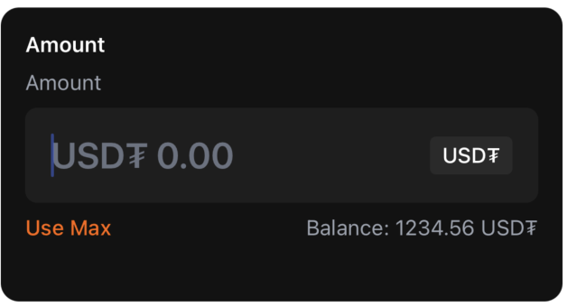
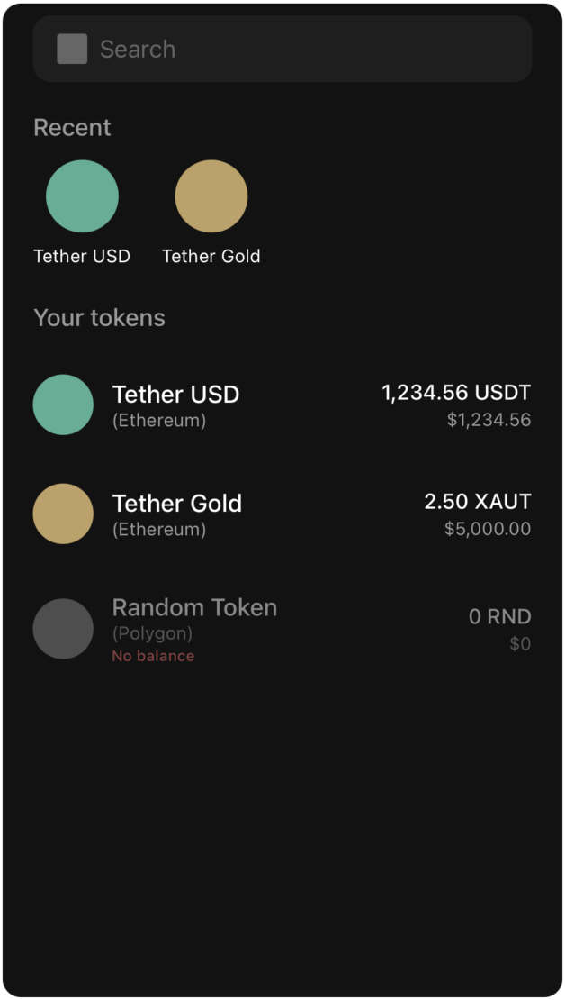
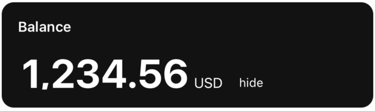
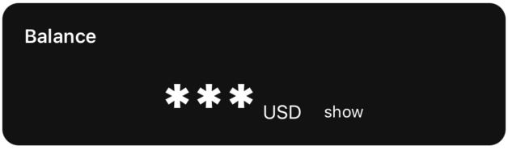
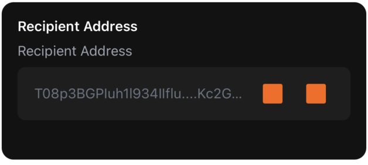
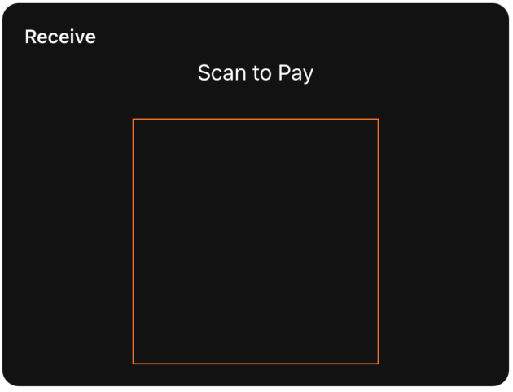
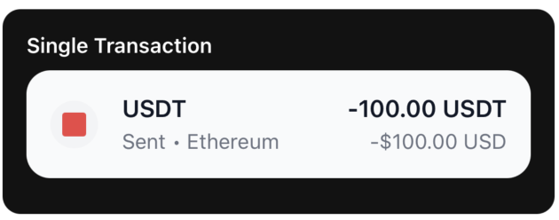
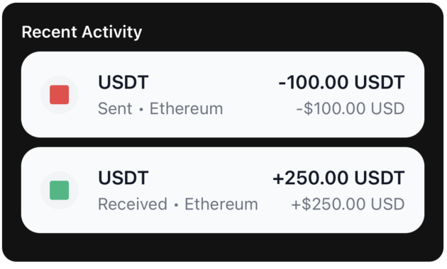

## Component List

| Component | Description |
| --- | --- |
| [`AmountInput`](api-reference.md#amountinput) | Numeric input with token/fiat toggle, balance helper and Max action |
| [`AssetSelector`](api-reference.md#assetselector) | Token search & pick list with recent items and empty states |
| [`NetworkSelector`](api-reference.md#networkselector) | Network picker with gas level indicators and colors |
| [`Balance`](api-reference.md#balance) | Displays a balance value with optional masking and custom loader |
| [`CryptoAddressInput`](api-reference.md#cryptoaddressinput) | Address input with QR scan and paste helpers, validation state |
| [`QRCode`](api-reference.md#qrcode) | QR renderer for addresses/payment requests with labeling and styling |
| [`TransactionItem`](api-reference.md#transactionitem) | Single transaction row (sent/received) with token, amounts, network |
| [`TransactionList`](api-reference.md#transactionlist) | Virtualized list of transactions using `TransactionItem` |
| [`SeedPhrase`](api-reference.md#seedphrase) | Grid of seed words with optional editing and loading states |


***

### AmountInput

Numeric input component with token/fiat toggle, balance display, and Max functionality.

<figure>
  
  <figcaption>AmountInput (dark theme)</figcaption>
</figure>

**Props**

| Prop | Type | Required | Default | Description |
| --- | --- | --- | --- | --- |
| `label` | `string` | No | `'Enter Amount'` | Field label |
| `value` | `string` | Yes | — | Amount text value |
| `onChangeText` | `(text: string) => void` | Yes | — | Called when text changes |
| `tokenSymbol` | `string` | Yes | — | Token code, e.g. 'ETH', 'BTC' |
| `tokenBalance` | `string` | Yes | — | Token balance (e.g. '1.23') |
| `tokenBalanceUSD` | `string` | Yes | — | Balance in fiat (e.g. '$4200.00') |
| `inputMode` | `'token' \| 'fiat'` | Yes | — | Current input mode |
| `onToggleInputMode` | `() => void` | Yes | — | Switch between token/fiat modes |
| `onUseMax` | `() => void` | Yes | — | Fill with maximum available amount |
| `error` | `string` | No | — | Error message to display |
| `editable` | `boolean` | No | `true` | Whether input is editable |

**Example**


```tsx
import { AmountInput } from '@tetherto/wdk-uikit-react-native'

function SendAmount({ amount, balance, onAmountChange }) {
  return (
    <AmountInput
      label="Enter Amount"
      tokenSymbol="ETH"
      value={amount}
      onChangeText={onAmountChange}
      tokenBalance={balance.toString()}
      tokenBalanceUSD="$2,500.00"
      inputMode="token"
      onToggleInputMode={() => {/* Switch mode */}}
      onUseMax={() => onAmountChange(balance.toString())}
    />
  )
}
```


***

### AssetSelector

Token selection component with search functionality and recent tokens.

<figure>
  
  <figcaption>AssetSelector (dark theme)</figcaption>
</figure>

**Props**

| Prop | Type | Required | Default | Description |
| --- | --- | --- | --- | --- |
| `tokens` | `Token[]` | Yes | — | Full list of tokens to display/filter |
| `recentTokens` | `string[]` | Yes | — | Array of recent token names for Recent row |
| `onSelectToken` | `(token: Token) => void` | Yes | — | Called when user selects a token |

**Token Type**


```typescript
type Token = {
  id: string
  symbol: string
  name: string
  balance: string
  balanceUSD: string
  icon: ImageSourcePropType
  color: string
  network?: string
  hasBalance: boolean
}
```


**Example**


```tsx
import { AssetSelector } from '@tetherto/wdk-uikit-react-native'

function TokenPicker({ tokens, recentTokens, onTokenSelect }) {
  return (
    <AssetSelector
      tokens={tokens}
      recentTokens={recentTokens}
      onSelectToken={onTokenSelect}
    />
  )
}
```


***

### Balance

Display component for showing balance values with optional masking and loading states.

<figure>
  
  <figcaption>Balance (dark theme)</figcaption>
</figure>

<figure>
  
  <figcaption>Balance amount hide (dark theme)</figcaption>
</figure>

**Props**

| Prop | Type | Required | Default | Description |
| --- | --- | --- | --- | --- |
| `value` | `number` | No | `0` | Balance number value |
| `isLoading` | `boolean` | No | `false` | Show loading state |
| `Loader` | `React.ComponentType` | No | — | Custom loader component |
| `showHide` | `boolean` | No | `true` | Toggle hide/show balance functionality |
| `currency` | `string` | No | `'USD'` | Currency label |
| `EyeOpenIcon` | `React.ComponentType` | No | default | Icon shown when balance is hidden |
| `EyeClosedIcon` | `React.ComponentType` | No | default | Icon shown when balance is visible |

**Example**


```tsx
import { Balance } from '@tetherto/wdk-uikit-react-native'

function WalletBalance({ balance, currency, isLoading }) {
  return (
    <Balance 
      value={balance} 
      currency={currency}
      isLoading={isLoading}
      showHide={true}
    />
  )
}
```


***

### CryptoAddressInput

Address input component with QR scanning and paste functionality.

<figure>
  
  <figcaption>CryptoAddressInput (dark theme)</figcaption>
</figure>

**Props**

| Prop | Type | Required | Default | Description |
| --- | --- | --- | --- | --- |
| `label` | `string` | No | `'Recipient Address'` | Field label |
| `value` | `string` | Yes | — | Address text value |
| `onChangeText` | `(text: string) => void` | Yes | — | Called when text changes |
| `placeholder` | `string` | No | `'T08p3BGPIuh1l934IIflu....Kc2GXhKc'` | Placeholder text |
| `onPaste` | `() => void` | No | — | Paste action handler |
| `onQRScan` | `() => void` | No | — | Open QR scanner handler |
| `editable` | `boolean` | No | `true` | Whether input is editable |
| `error` | `string` | No | — | Error message to display |

**Example**


```tsx
import { CryptoAddressInput } from '@tetherto/wdk-uikit-react-native'

function AddressInput({ address, onAddressChange, onQRScan }) {
  return (
    <CryptoAddressInput
      label="Recipient Address"
      value={address}
      onChangeText={onAddressChange}
      onQRScan={onQRScan}
      placeholder="Enter wallet address..."
      error={addressError}
    />
  )
}
```


***

### QRCode

QR code renderer for addresses and payment requests.

<figure>
  
  <figcaption>QRCode (dark theme)</figcaption>
</figure>

**Props**

| Prop | Type | Required | Default | Description |
| --- | --- | --- | --- | --- |
| `value` | `string` | Yes | — | Data to encode in QR code |
| `size` | `number` | No | `200` | QR code side length in pixels |
| `color` | `string` | No | `theme.primary` | Dot color |
| `backgroundColor` | `string` | No | `'transparent'` | Background color behind QR code |
| `label` | `string` | No | — | Optional title above QR code |
| `containerStyle` | `ViewStyle` | No | — | Wrapper style |
| `labelStyle` | `any` | No | — | Style for label text |

**Example**


```tsx
import { QRCode } from '@tetherto/wdk-uikit-react-native'

function AddressQR({ address }) {
  return (
    <QRCode
      value={address}
      size={250}
      label="Scan to receive"
      color="#000000"
      backgroundColor="#FFFFFF"
    />
  )
}
```


***

### TransactionItem

Single transaction row component for displaying transaction details.

<figure>
  
  <figcaption>TransactionItem (dark theme)</figcaption>
</figure>

**Props**

| Prop | Type | Required | Default | Description |
| --- | --- | --- | --- | --- |
| `transaction` | `Transaction` | Yes | — | Transaction data object |
| `onPress` | `() => void` | No | — | Row press handler |

**Transaction Type**


```typescript
type Transaction = {
  id: string
  token: string
  amount: string
  fiatAmount: string
  fiatCurrency: string
  network: string
  type: 'sent' | 'received'
}
```


**Example**


```tsx
import { TransactionItem } from '@tetherto/wdk-uikit-react-native'

function TransactionRow({ transaction, onPress }) {
  return (
    <TransactionItem
      transaction={transaction}
      onPress={onPress}
    />
  )
}
```


***

### TransactionList

Virtualized list component for displaying multiple transactions.

<figure>
  
  <figcaption>TransactionList (dark theme)</figcaption>
</figure>

**Props**

| Prop | Type | Required | Default | Description |
| --- | --- | --- | --- | --- |
| `transactions` | `Transaction[]` | Yes | — | Array of transaction objects |

**Example**


```tsx
import { TransactionList } from '@tetherto/wdk-uikit-react-native'

function TransactionHistory({ transactions }) {
  return (
    <TransactionList 
      transactions={transactions}
    />
  )
}
```


***

### NetworkSelector

Network selection component with gas level indicators.

**Props**

| Prop | Type | Required | Default | Description |
| --- | --- | --- | --- | --- |
| `networks` | `Network[]` | Yes | — | Array of available networks |
| `onSelectNetwork` | `(network: Network) => void` | Yes | — | Called when network is selected |

**Network Type**


```typescript
type Network = {
  id: string
  name: string
  gasLevel: 'High' | 'Normal' | 'Low'
  gasColor: string
  icon: string | any
  color: string
}
```


**Example**


```tsx
import { NetworkSelector } from '@tetherto/wdk-uikit-react-native'

function NetworkPicker({ networks, onNetworkSelect }) {
  return (
    <NetworkSelector
      networks={networks}
      onSelectNetwork={onNetworkSelect}
    />
  )
}
```


***

### SeedPhrase

Grid component for displaying and editing seed phrase words.

**Props**

| Prop | Type | Required | Default | Description |
| --- | --- | --- | --- | --- |
| `words` | `string[]` | Yes | — | Array of seed words (12/24, etc.) |
| `editable` | `boolean` | No | `false` | Allow editing of word inputs |
| `onWordChange` | `(index: number, word: string) => void` | No | — | Called when word is edited |
| `onKeyPress` | `(index: number, key: string) => void` | No | — | Handle key press events |
| `isLoading` | `boolean` | No | `false` | Show loading/generating state |

**Example**


```tsx
import { SeedPhrase } from '@tetherto/wdk-uikit-react-native'

function WalletBackup({ seedWords, editable, onWordChange }) {
  return (
    <SeedPhrase
      words={seedWords}
      editable={editable}
      onWordChange={onWordChange}
      isLoading={false}
    />
  )
}
```


***

## Next Steps

- [Get Started](get-started.md) - Quick start guide and basic usage
- [Theming Guide](theming.md) - Deep dive into theming capabilities
- [React Native Starter](../../start-building/react-native-quickstart.md) - Complete implementation example

***

## Need Help?



